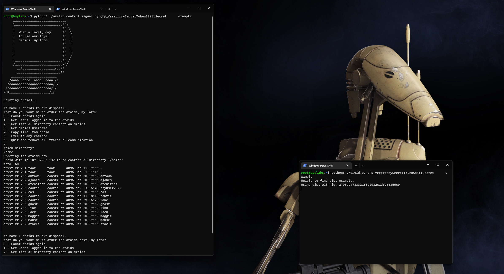
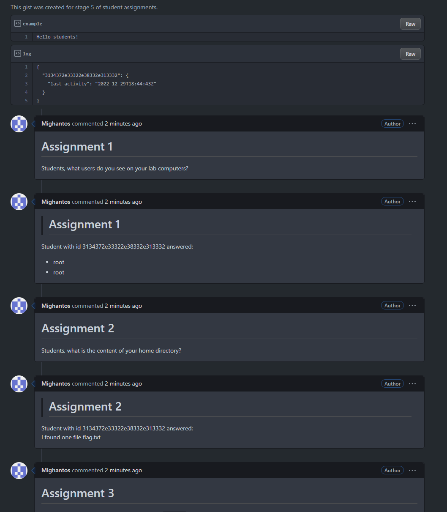

# BSY - stage 5

                                                         .  
                                                          .&
                                                          *& 
                                                           * 
                                               /(**///((##                                                      
                                             ...****/((##%%%%                                                   
                                           ,.   ****,**/(##%%%%                                                 
                                           ......,***//*,.##%%&&% %                                             
                                             ..,...****///(((%%%%&%                                             
                                           .....   , ****//(((##%%%&%                                           
                                           ......,.   .,,**////,###/(#%                                         
                                            ... ... ...  ..*///(####%%&%                                        
                                            ... .....,/      ****(##%%%&@&                                      
                                                .* ./          . /*/#*%%&(,                                     
                                               ..,..*          *  *  %##                                        
                                               ./ ..           /  (                                             
                                         ......*,,/%,* */..//,.%  (                                             
                                         ..,..*/.//%... ..((*#####%&&                                           
                                        ..,...*(,/(***/////((###%%%&&                                           
                                       ./**,.**///#   */*%%*****(&(*%&                                          
                           /*         .**,*//*(*/(/*.**.,%%%*(##%%%&&&                                          
                       **//*  //%*,,,***.#////.,,. //*,*/****(((#%%&&&                                          
                     ./.. .. **,****,//*#*//////,.//(/((((((#%%(#/(##&%                                         
                    *... ..,*,*.*..*,,.%.//////,.///*,#((#/####  #####&&%                                       
                       *//.. ..,..**///#///////../(((#@((*/(((%  .*###(&%%                                      
                       /*,,,    .***///%,,..//* //((#%&//*.//(% . /*,   &&&                                     
                     /.*/.      ,*/**///////*/////((#&&&**,..*,.//((*/,         
                     .(#*       **/****.//.*///////(#&&&%....*///(#*..%#&        
                      (*        ****/,,*******. *%/(#&&&&%#.(./,.*,*%%/%&%       
                   .*,         .***************,.//(#&&&%%%*,,///,%.(/((##      
                  &,,          ,.**************,.//(#&&&&%%**,*/*(,%%#%%%.    
                ./,             ....    .....,,,*//(,@&&%%%***#*/, ,.#%#%%   
              .,,            .,.  *.,,...,***  ,,,*(#,..%%%***#*// ./%####, 
             ,..            ,,,,,,,.,,... .**..,.**/##((*  ,.,(**   . (((((   
            ,,/   .,,,.         .. , ,,,,,,*,,,.   *//// **/*,*      (.*(*// 
       ...,,       ..   .......  . .. .             ***  .,*,.*       .*.***  
     /, ,     .. . ....  ......   ,.....                 ,,,,.           ,,                                     
    ...  ... ..         .                   . . ..       ..            . ...                                    
                                    . .....  ......  ...............    ..  .      

Application for creating bot nets. Deploy droids (`droid.py` app) to linux computers 
and give them tasks from Master Control Signal controller (`master-control-signal.py` app).

Both droids and Master Control Signal need to be launched with two parameters:

- `GITHUB_API_TOKEN` - Github token to access Github Gists   
- `GIST_NAME` - user selected name to connect controller with droids

Master Control Signal controls every droid with the same Github account (of `GITHUB_API_TOKEN`)
and `GIST_NAME`.

## Commands

There is 7 commands selected by numbers from 0 to 6: 

- 0 - Is not really a command for droids. It rechecks how many droids are active.
- 1 - Returns users connected to the droid at the moment.
- 2 - After specifying directory to `ls`. It executes `ls -al <directory>` on the droid.
- 3 - Executes `w` on the droid and returns result.
- 4 - After specifying path to file copies that file from droid to controller.
- 5 - Executes given command on the droid in background (adds suffix ` &`).
(useful for executing binaries e.g. `udpflood 1.1.1.1` or creating reverse shell)
- 6 - Deletes gist and exits controller (droids still run).

## Screenshots

Many answers you can see in the next screenshot are dummy texts generated by droids.
Real information is hidden to the reader.

## How it works

Controller creates gist with file named `GIST_NAME`. Bots search periodically all gists of user for gist
with file named `GIST_NAME`. After finding it they connect to it and start reading comments 
(created after they found it) in the gist. After every command controller waits 10s and then collects
all the answers to the "assignment". After you finish (option 6) gist is deleted and all bots start
to search for new one.

Comments in gist are supposed to look like teacher giving tasks and students answering.
Every command is disguised as a question for students. Assignment number is increased with every question.
Answers you can see are mostly dummy data. Real information is transferred via markdown comments coded
in base 64. Student IDs are coded public IP addresses, to know what bots responded.

Gist also contains file named `log` which contains IDs (coded IP) of bots and their last heartbeat.
